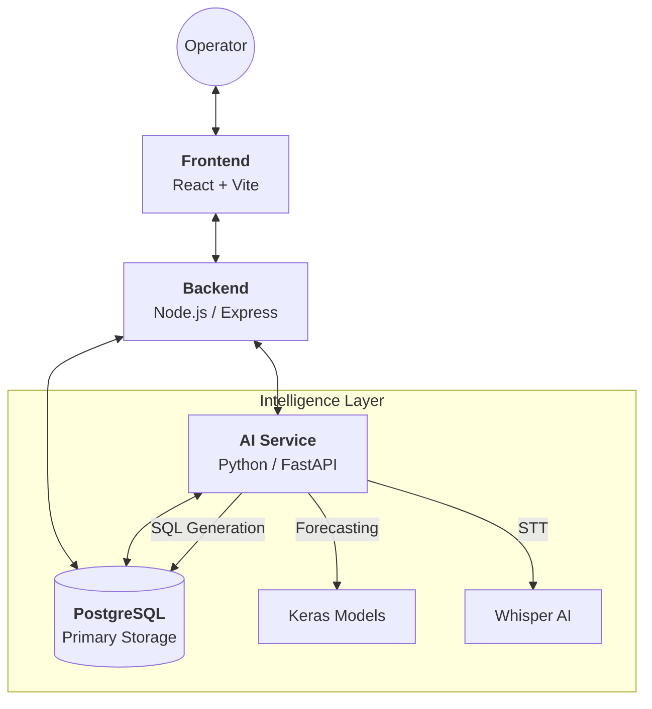

# Esyasoft AI CoPilot ⚡


Esyasoft AI CoPilot is a comprehensive, AI-driven platform designed for modern electrical grid operations. It empowers operators with natural language data exploration, automated visualizations, and intelligent predictive forecasting.

---

## 🚀 Key Features

### 🧠 Intelligent Data Exploration
- **Natural Language to SQL**: Query complex grid data using plain English.
- **Intent-Based Routing**: Automatically distinguishes between database queries, forecasts, and general assistance.
- **Automated Insights**: AI-generated summaries and trend analysis for every data result.

### � Advanced Analytics
- **Revenue Forecasting**: High-precision predictions using Keras-based deep learning models.
- **Historical Load Analysis**: Deep dives into meter loads and user consumption patterns.
- **Interactive Visualizations**: Dynamic Plotly charts (Line, Bar) that render automatically based on data context.

### 🛡️ Enterprise-Grade Security
- **Role-Based Access Control (RBAC)**: Distinct permissions for Admins and Employees.
- **Secure Authentication**: OTP-based login verified via email.
- **Session Integrity**: Hardened JWT-based session management and route protection.

### 🎤 Ease of Use
- **Voice-to-Query**: Integrated Faster-Whisper for hands-free grid management.
- **Premium UI**: State-of-the-art dark/light mode interface built with Mantine UI.

---

## 🏗️ System Architecture

The platform operates as a distributed system of three specialized modules communicating via RESTful APIs.



---

## 🛠️ Tech Stack

| Component | Technology | Usage |
| :--- | :--- | :--- |
| **Frontend** | React 18, TypeScript, Vite | User Interface & Visualizations |
| | Mantine UI, Plotly.js | Design System & Automated Charts |
| | Redux Toolkit | Global State Management |
| **Backend** | Node.js, Express, TypeScript | API Orchestration & Security |
| | PostgreSQL, Nodemailer | Persistence & Auth Workflow |
| **AI Service** | Python 3.10+, FastAPI | LLM Routing & Analytical Logic |
| | TensorFlow/Keras, Pandas | Deep Learning & Data Processing |
| | Faster-Whisper | Speech-to-Text Transcription |

---

---

## ⚙️ Installation & Setup

### I. Core Modules Setup

#### 1. Database Setup
Create a PostgreSQL database (e.g., `chatbot_db`) and ensure it is accessible. Run the migration scripts if available to initialize the schema.

#### 2. AI Service Configuration (Python)
```bash
cd ai-service
# Create and activate virtual environment
python -m venv .venv
source .venv/bin/activate  # Windows: .venv\Scripts\activate

# Install dependencies
pip install -r requirements.txt

# Configure Environment
cp .env.example .env
```
**Required Variables in `ai-service/.env`:**
```ini
DB_TYPE=postgresql
POSTGRES_HOST=localhost
POSTGRES_PORT=5432
POSTGRES_DB=chatbot_db
POSTGRES_USER=your_user
POSTGRES_PASSWORD=your_password
```

#### 3. Backend Configuration (Node.js)
```bash
cd ../backend
npm install
```
**Required Variables in `backend/.env`:**
```ini
PORT=5000
DB_HOST=localhost
DB_PORT=5432
DB_NAME=chatbot_db
DB_USER=your_user
DB_PASSWORD=your_password
JWT_SECRET=your_secret_key
GROQ_API_KEY=your_groq_key
```

#### 4. Frontend Configuration (React)
```bash
cd ../frontend
npm install
```
**Required Variables in `frontend/.env`:**
```ini
VITE_API_URL=http://localhost:5000/api
```

---

### II. Extra Services Setup

#### 📧 Mail Service (OTP Authentication)
The platform uses SMTP for sending login OTPs. This is managed by the Backend.

**Step-by-Step Setup:**
1.  Obtain SMTP credentials (e.g., from Gmail App Passwords or SendGrid).
2.  Add the following to your `backend/.env`:
    ```ini
    SMTP_HOST=your_host (e.g., smtp.gmail.com)
    SMTP_PORT=587
    SMTP_USER=your_email@example.com
    SMTP_PASS=your_app_password
    MAIL_FROM=no-reply@Esyasoft.ai
    ```

#### 🎥 Multimedia (Speech-to-Text)
The AI Service supports voice-to-query via FFmpeg and Faster-Whisper.

**Step-by-Step Setup:**
1.  **Install FFmpeg**:
    -   Download from [gyan.dev](https://www.gyan.dev/ffmpeg/builds/).
    -   Extract `ffmpeg.exe` to the `ai-service/` root directory (the script will automatically find it there).
2.  **Enable STT in Python**:
    -   Activate the `ai-service` virtual environment.
    -   Install the engine: `pip install faster-whisper`.
3.  **Restart AI Service**: The Whisper model (base.en) will load on the next startup.

---

## 🏃 Running the Application

For full functionality, start the modules in this specific order:

1.  **AI Service**: 
    ```bash
    cd ai-service && python main.py
    ```
2.  **Backend**: 
    ```bash
    cd backend && npm run dev
    ```
3.  **Frontend**: 
    ```bash
    cd frontend && npm run dev
    ```
    Access the UI at `http://localhost:5173`.

---

## 📜 Project Ownership & License
Esyasoft AI CoPilot is an internal tool for advanced grid monitoring.
License: **ISC**
